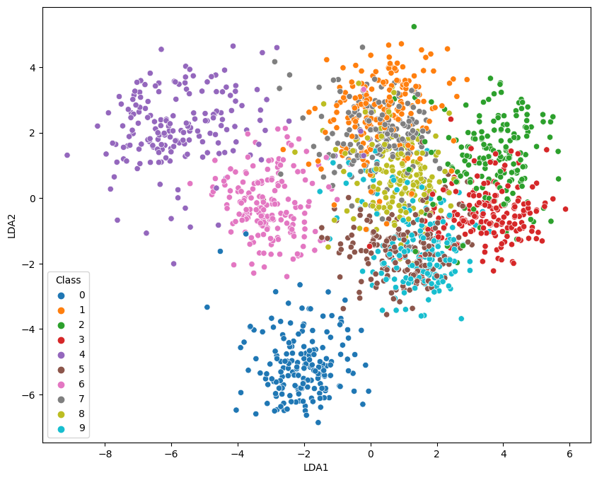
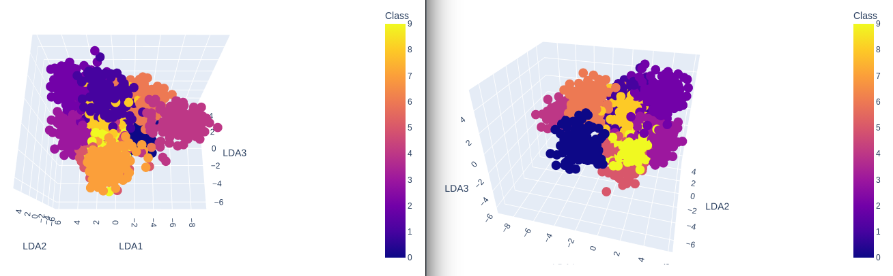

---
jupyter:
  jupytext:
    formats: ipynb,md
    text_representation:
      extension: .md
      format_name: markdown
      format_version: '1.3'
      jupytext_version: 1.14.4
  kernelspec:
    display_name: Python 3 (ipykernel)
    language: python
    name: python3
---

# Dimensionality Reduction for Image Segmentation

Use [Manifold Learning](https://scikit-learn.org/stable/auto_examples/manifold/plot_lle_digits.html) and the [LD Analysis](https://mpolinowski.github.io/docs/IoT-and-Machine-Learning/ML/2023-04-13-fisher-discriminant-analysis/2023-04-13) to Visualize Image Datasets.

## Fisher Discriminant Analysis

```python
import matplotlib.pyplot as plt
import plotly.express as px
import pandas as pd
import seaborn as sns
from sklearn.datasets import load_digits
from sklearn.discriminant_analysis import LinearDiscriminantAnalysis
```

### Digits Dataset

```python
# load digits dataset with labels
X,y = load_digits(return_X_y=True)
X.shape
# (images, features)
# (1797, 64)
```

### 2-Dimensional Plot

```python
no_components = 2

lda = LinearDiscriminantAnalysis(n_components = no_components)
X_lda = lda.fit_transform(X , y=y)

data = pd.DataFrame({
    'LDA1': X_lda[:,0],
    'LDA2': X_lda[:,1],
    'Class': y})
```

```python
fig = plt.figure(figsize=(10, 8))
sns.scatterplot(
    x='LDA1',
    y='LDA2',
    hue='Class',
    data=data,
    palette='tab10')
```




### 3-Dimensional Plot

```python
no_components = 3

lda = LinearDiscriminantAnalysis(n_components = no_components)
X_lda = lda.fit_transform(X , y=y)

data = pd.DataFrame({
    'LDA1': X_lda[:,0],
    'LDA2': X_lda[:,1],
    'LDA3': X_lda[:,2],
    'Class': y})

plot = px.scatter_3d(
    data,
    x = 'LDA1',
    y = 'LDA2',
    z = 'LDA3',
    color='Class')

plot.show()
```



```python

```
